# 基本資訊

- 姓名：施文皓
- 性別：男
- 生日：1984
- 興趣：烹飪、揪好友吃飯、貓
- GITHUB: [ESCAT](https://github.com/es-cat)

# 個人特質
- 擅長頗析問題，擬定方案並付諸實行；偏向使用規則、工具解決各種議題及需求。
- 設計思考偏向穩定、擴充性、安全性為主，就事論事，喜歡有話直說公開討論的環境。
- 喜愛用程式來解決疑難雜症大小事，看到重複的事情會忍不住想要自動化
# 專業技術
#### 程式語言
    ASP.NET
    ASP.NET MVC 3
    Visual Studio C#
    Javascript, JQuery, Angularjs, Vuejs, HTML, SocketIO
    T-SQL
    NODEJS
#### ＳＥＯ
    Basic SEO Rules
    Google Analytics
#### 第三方ＡＰＩ＆平台
    SNS API
    Email API
    Microsoft Azure Platform (cloud service)
    Bank Payment API (credit card, Transfer)
    Edenred Order API (online electric ticket system)
    Facebook Login API, Graph API, Message API
    Google Login API, Google Map API, Youtube API, ReCaptcha, etc.
    Line Login API, Line Business connect API, Line Channel API
# 代表實績
- 粉多任務紅利專區、訊息中心、會員驗證等功能 (前端工程、金流、第三方API串接) [粉多任務](http://www.friendo.com.tw/)
- 粉多任務品牌基地系統(前端工程、系統設計主導) 
    - 以此系統開發的專案： [維豐肉乾](http://www.friendo.com.tw/weifone)、 [一品禪](http://www.friendo.com.tw/yipinchan)、
[Samova](http://www.friendo.com.tw/samova)、
[果蕊](http://www.friendo.com.tw/glyceutical)、
[中國信託](http://site.friendo.com.tw/ctbc) 等
- 粉多任務版型系統(前端工程、系統設計主導)  
    - 以此系統開發的專案：[漢堡王黑皮堡](http://www.friendo.com.tw/Mission/3841)、
[漢堡王](http://www.friendo.com.tw/Mission/3958)、
[喜特麗](http://www.friendo.com.tw/Mission/3641)、
[SAMOVA](http://www.friendo.com.tw/Mission/4086)、
[威航](http://www.friendo.com.tw/Mission/4139) 等
- 擔任程式主管期間兩年 [期間領導開發專案](http://www.friendo.com.tw/brands)
    - [晶碩](http://site.friendo.com.tw/pegavision-girl)
、[凱基銀行](http://site.friendo.com.tw/KGIloveyourself)、[ASUS](http://www.asus.com/tw/event/photopk/)、[家樂福](http://carrefour.friendo.com.tw/carrefour2016)、[中國信託](http://site.friendo.com.tw/hellofriendslot)、[P&G分享平台](http://www.pglivingshare.com/zh_tw) 等
    - 改善開發流程，掌握新技術以輔佐營運團隊開拓業務
    - 降低專案程式端成本40%
    - 推動SOP提升專案品質

# 公司實績
- 2014 時際創意傳媒 第三十六屆華文廣告金像獎-環境媒體運用類
    - 獲獎專案：Screen Chat 螢幕聊天室
- 2015 動腦雜誌 年度傑出數位行銷公司 銅獎
- 2016 經濟部 SBIR績優計畫評選獲獎
    - 獲獎產品：粉多任務 (MAAS雲端行銷服務平台研發)
-   [台灣微軟雲端合作夥伴](https://www.microsoft.com/taiwan/casestudies/case/case_120827_friendo.aspx)

# 經歷
- 高雄義守大學 資訊工程學系畢業
- 雷震科技股份有限公司 2009／09 ～ 2010／12
- 春樹科技股份有限公司 2011／01 ～

        入社會前兩年參與了數十個政府網站製作，認識了模組化設計與程式測試，第一次體會到模組化的威力與其麻煩之處。
        
        後來因為工作上的接觸，認識了春樹科技的執行長，深入聊了幾次，蠻認同他的商業洞察與價值觀，便加入了春樹科技開始粉多交友網站的製作。在這個產品中，我負責好友關係鏈、商城、站內訊息、會員驗證等的系統設計及施作，也負責微軟雲端環境架設、管理及公司內部ＭＩＳ事務。

        隔年粉多交友上線，但在FACEBOOK的強大競爭下，同年公司改變策略，著手製作粉多任務；在這個產品中，我負責前端工程，將粉多交友部分功能轉移至粉多任務，並讓使用者慢慢將重心轉移到粉多任務。
        
        粉多任務營運一年後，營運團隊找到了一些甜蜜點，於是開始著手版型系統的研發，在此專案中我與二位同事一同負責系統設計與開發。之後因客戶需求擴大，又擴充了品牌基地及任務的功能。
        
        之後公司業務持續擴展，開始接獨立專案的ＣＡＳＥ，客戶的需求也越來越不同；之後我被升為程式部門主管，領導6人團隊，期間程式部除了製作專案外，也進行了專案製作流程標準化、新技術導入、功能模組化、連續整合模式、自動部署、自動化工具 等優化。
# 附件

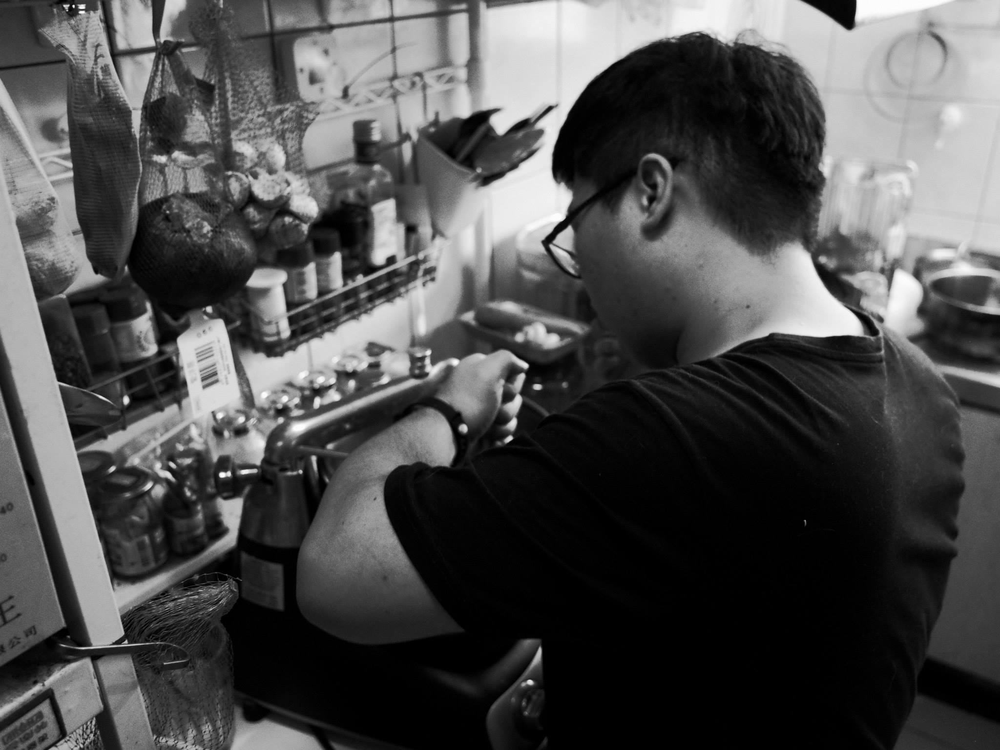

兌換中心

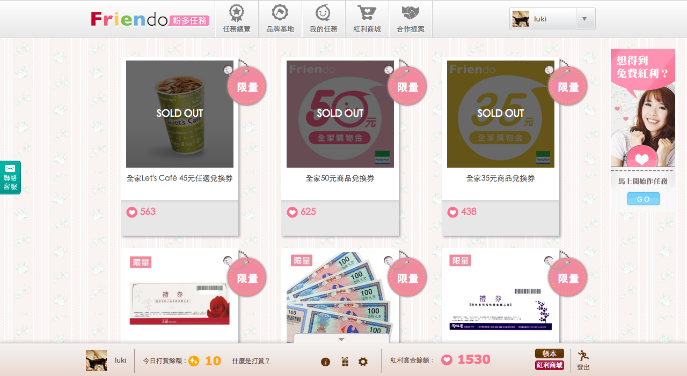

訊息中心

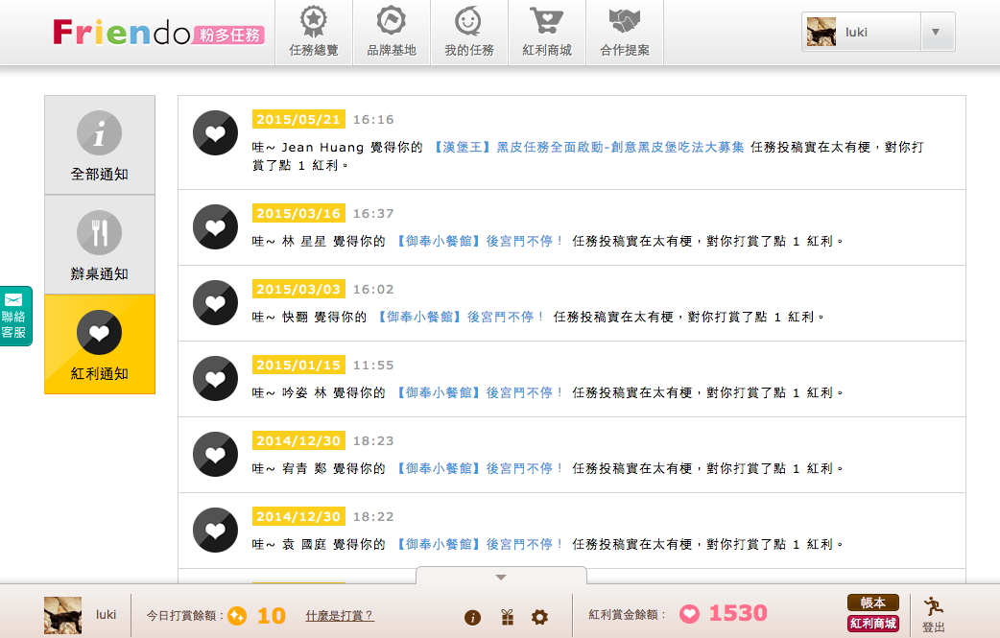

帳號認證

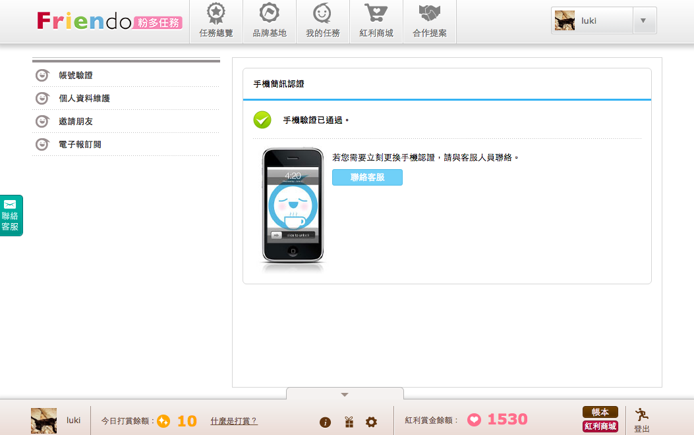

家樂福中元節活動

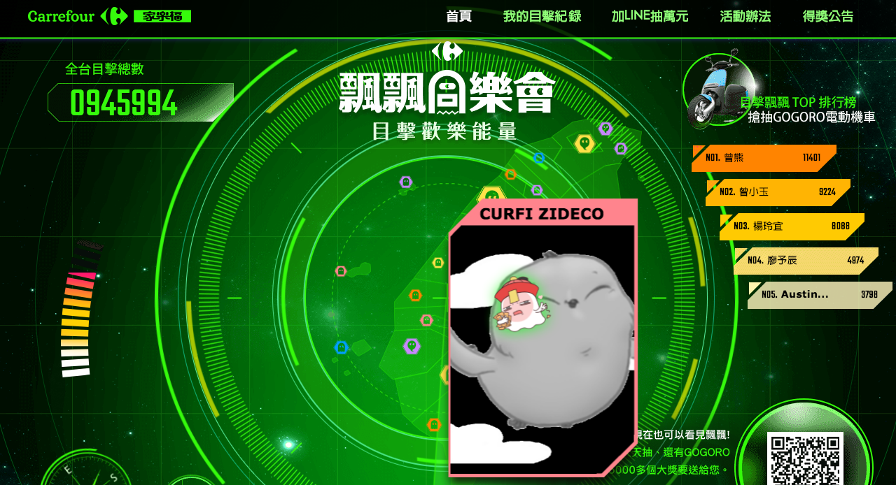

凱基銀行愛自己分享家

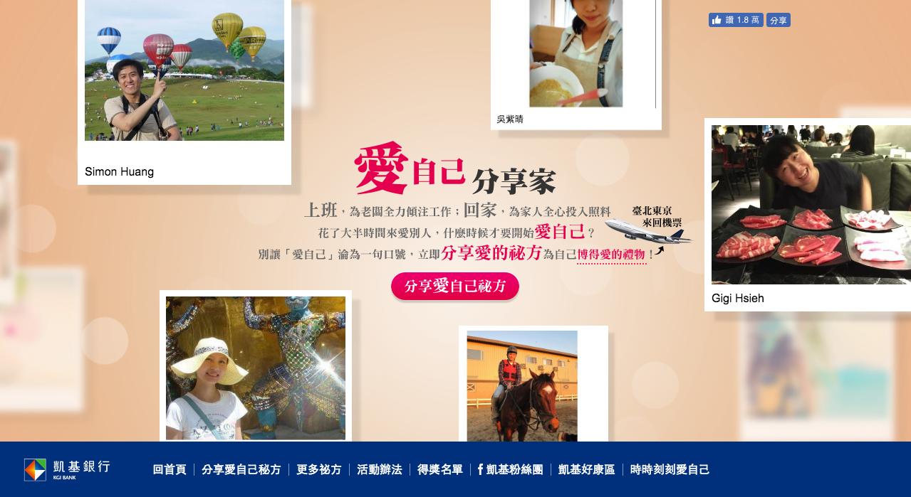

華碩美景大對決

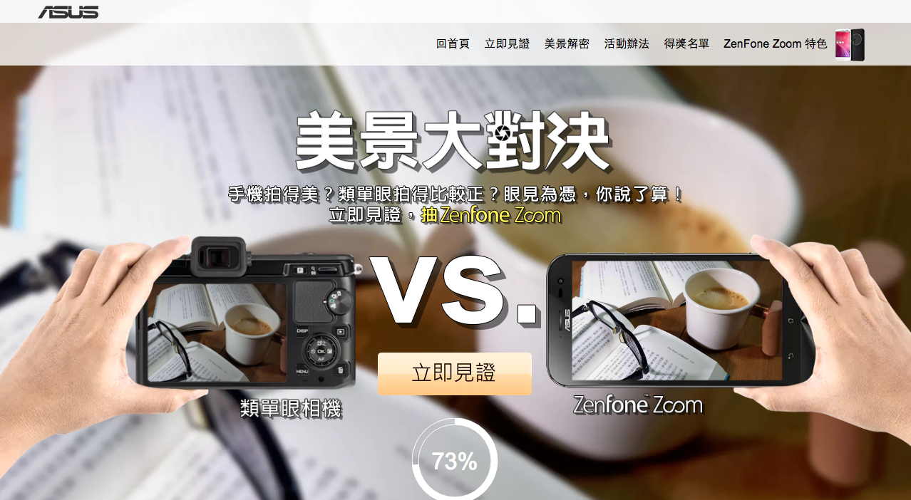

晶碩撫子女孩交叉點

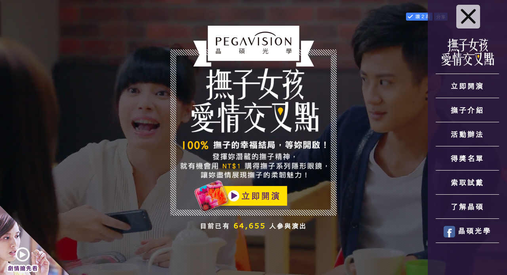

動腦雜誌 年度傑出數位行銷公司 銅獎

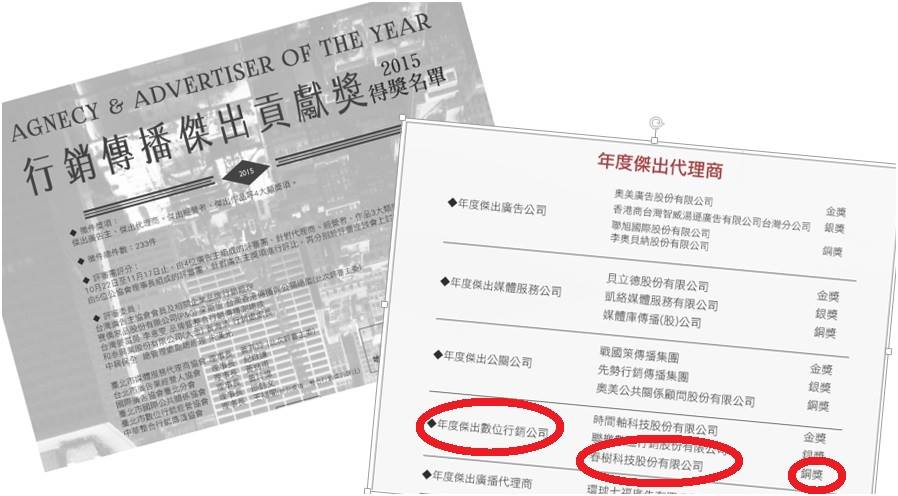

經濟部 SBIR績優計畫評選

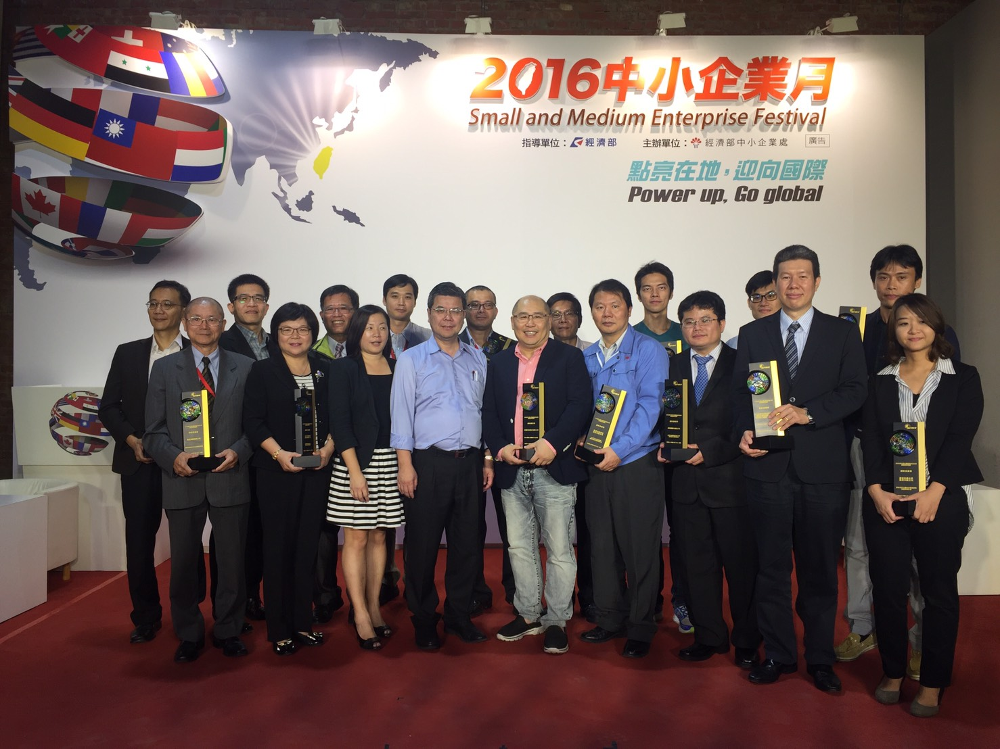

假日小聚

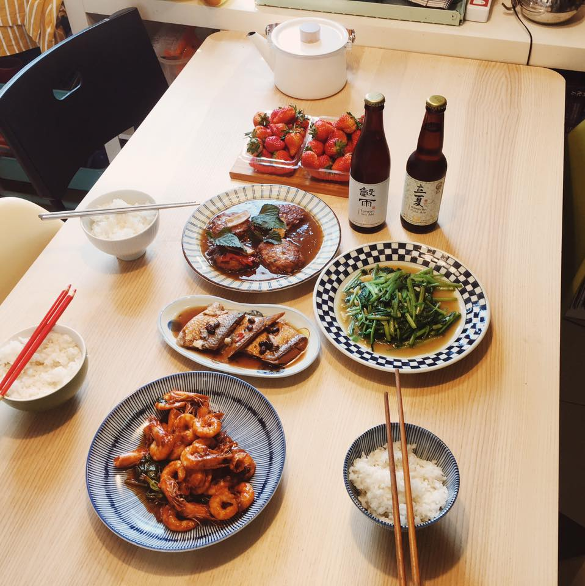

Paella

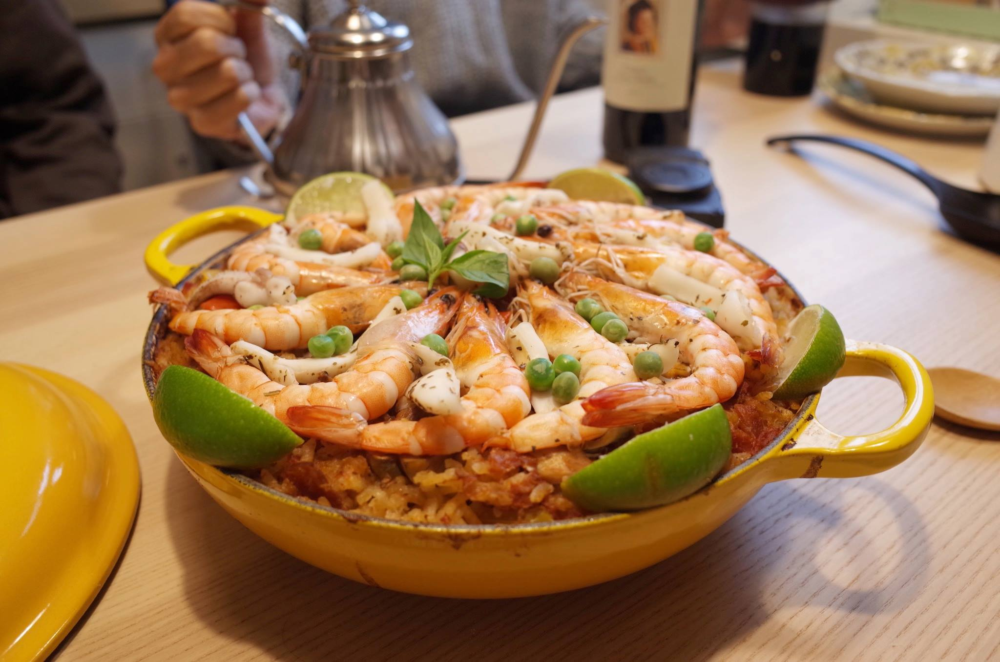